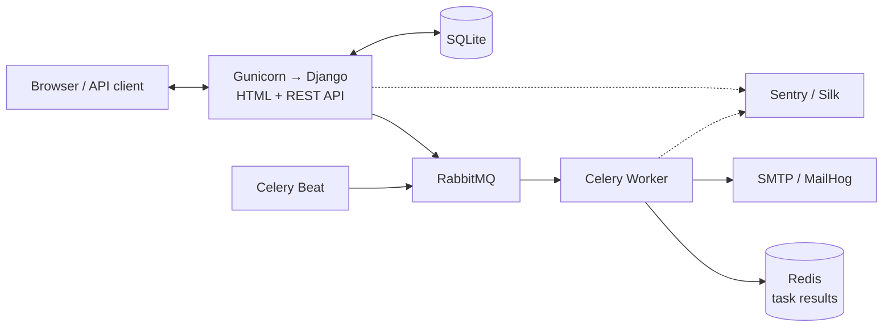

# New-Makers

New-Makers — учебный веб-сервис для поиска IT-команды и совместной работы над
проектами. Владельцы публикуют проекты и открытые роли, специалисты оформляют
профессиональные профили, откликаются на подходящие позиции или принимают
персональные приглашения в команду.

Проект объединяет серверный HTML-интерфейс и REST API, поддерживает фоновые
email-уведомления, OAuth-аутентификацию, модерацию контента и историю изменений.

> **Статус:** учебный проект, находится в активной разработке.

## Возможности

- регистрация и вход по логину, email, Google или GitHub;
- каталог опубликованных проектов и открытых ролей;
- поиск и фильтрация проектов и специалистов;
- профиль специалиста с ролью, уровнем, технологиями и доступностью;
- создание проекта, управление вакансиями и жизненным циклом публикации;
- отклики специалистов и приглашения от владельцев проектов;
- формирование команды после принятия отклика или приглашения;
- избранные проекты;
- административная модерация проектов, справочников;
- email-уведомления и периодические фоновые задачи;
- REST API с ролевыми ограничениями и Postman-коллекцией.

## Роли пользователей

Роли в New-Makers описывают сценарии использования, но не являются полностью
взаимоисключающими. Пользователь с профилем специалиста может создать собственный
проект и одновременно стать его владельцем.

| Роль             | Возможности                                                                                                                                       |
| ---------------- | ------------------------------------------------------------------------------------------------------------------------------------------------- |
| Гость            | Просматривает опубликованные проекты, открытые роли, доступных специалистов и справочники.                                                        |
| Специалист       | Настраивает профиль и доступность, ищет проекты, добавляет их в избранное, отправляет отклики, отвечает на приглашения.                           |
| Владелец проекта | Создаёт и редактирует свои проекты, управляет открытыми ролями, отправляет проекты на модерацию, рассматривает отклики и приглашает специалистов. |
| Администратор    | Управляет всеми сущностями, видит скрытые и непубличные записи и может выполнять действия независимо от владельца объекта.                        |

## Архитектура

```text
Browser / API client
        |
        v
Gunicorn -> Django (HTML + REST API) -> SQLite
                  |
                  +-> RabbitMQ -> Celery Worker -> Redis (task results)
                  |       ^             |
                  |       |             +-> SMTP / MailHog
                  |   Celery Beat
                  |
                  +-> Sentry / Silk
```



- **Django** обслуживает HTML-страницы, API, авторизацию и бизнес-логику.
- **RabbitMQ** является брокером фоновых Celery-задач.
- **Celery Worker** выполняет email-уведомления и служебные задачи.
- **Celery Beat** публикует периодические задачи по расписанию.
- **Redis** хранит результаты выполнения Celery-задач.
- **MailHog** принимает исходящие письма в локальном окружении.
- **SQLite** используется как основная база данных текущей версии проекта.

## Технологии

| Область                     | Технологии                                            |
| --------------------------- | ----------------------------------------------------- |
| Backend                     | Python 3.13, Django 6, Django REST Framework          |
| Данные                      | SQLite, Django ORM, django-filter                     |
| Фоновые задачи              | Celery 5.6, RabbitMQ 4.2, Redis 7, django-celery-beat |
| Аутентификация              | Django Allauth, Google OAuth2, GitHub OAuth           |
| Email                       | Django Email Backend, MailHog                         |
| Наблюдаемость               | Sentry, Django Silk, Django Debug Toolbar             |
| История и администрирование | django-simple-history, django-import-export           |
| Запуск                      | Docker Compose, Gunicorn, WhiteNoise                  |

## Быстрый запуск

Для основного сценария запуска нужны Docker и Docker Compose.

```bash
git clone https://github.com/catsclaw-dev/new-makers.git
cd new-makers
cp .env.example .env
docker compose up -d --build
```

Перед первым запуском следует настроить файл `.env`.
Полный список поддерживаемых настроек и локальные значения приведены в
[`.env.example`](.env.example).

При старте контейнера Django автоматически выполняются миграции и сбор
статических файлов.

### Доступные сервисы

| Сервис              | Адрес                          | Назначение                               |
| ------------------- | ------------------------------ | ---------------------------------------- |
| New-Makers          | <http://127.0.0.1:8000>        | Веб-интерфейс и REST API                 |
| Django Admin        | <http://127.0.0.1:8000/admin/> | Администрирование проекта                |
| RabbitMQ Management | <http://127.0.0.1:15672>       | Очереди, подключения и состояние брокера |
| MailHog             | <http://127.0.0.1:8025>        | Просмотр локальных email-писем           |

Локальные данные RabbitMQ по умолчанию: `meetservice` / `meetservice`. Эти
значения предназначены только для разработки.

### Управление контейнерами

```bash
# Состояние сервисов
docker compose ps

# Логи приложения и фоновых процессов
docker compose logs -f web celery_worker celery_beat

# Остановка без удаления данных
docker compose down

# Пересборка после изменения кода или зависимостей
docker compose up -d --build
```

`db.sqlite3` подключается в контейнер как файл из корня репозитория и не
удаляется командой `docker compose down -v`.
Флаг `-v` удаляет именованные volumes RabbitMQ и статических файлов, поэтому применять его без необходимости не следует.

## REST API

API доступен по префиксу `/api/`. Используются Session Authentication и Basic
Authentication. Списки разбиваются на страницы по 20 записей и поддерживают
фильтрацию, поиск через `?search=` и сортировку через `?ordering=`.

| Ресурс               | Чтение                                                                       | Изменение и специальные действия                                                       |
| -------------------- | ---------------------------------------------------------------------------- | -------------------------------------------------------------------------------------- |
| `/api/roles/`        | Публично, только активные роли                                               | Создание, изменение и удаление — администратор                                         |
| `/api/technologies/` | Публично, только активные технологии                                         | Создание, изменение и удаление — администратор                                         |
| `/api/projects/`     | Публичные проекты доступны всем; владелец видит также свои непубличные       | Создание — авторизованный пользователь; изменение — владелец или администратор         |
| `/api/vacancies/`    | Публичные вакансии доступны всем                                             | Управление — владелец соответствующего проекта или администратор                       |
| `/api/specialists/`  | Доступные профили публичны; скрытый профиль виден владельцу и администратору | Управление — владелец профиля или администратор                                        |
| `/api/applications/` | Специалист видит свои отклики, владелец — отклики на свои проекты            | Отклик создаёт специалист; принимает или отклоняет владелец проекта либо администратор |
| `/api/invitations/`  | Доступны получателю, отправителю, владельцу проекта и администратору         | Владелец приглашает специалиста; получатель принимает или отклоняет приглашение        |
| `/api/favorites/`    | Только собственное избранное                                                 | Авторизованный пользователь управляет только своими записями                           |

### Основные API-действия

```text
GET|POST  /api/projects/{id}/vacancies/
POST      /api/projects/{id}/submit_for_moderation/
POST      /api/projects/{id}/close/
POST      /api/projects/{id}/reopen/
POST      /api/projects/{id}/archive/
POST      /api/projects/{id}/favorite/

GET|PUT|PATCH /api/specialists/me/

POST      /api/applications/{id}/accept/
POST      /api/applications/{id}/reject/
POST      /api/invitations/{id}/accept/
POST      /api/invitations/{id}/decline/

```

Проекты фильтруются по стадии, формату участия, статусу, владельцу, технологии,
роли и наличию открытых позиций. Для специалистов доступны фильтры по роли,
технологии, уровню, статусу доступности, формату участия, городу и опыту.

Примеры запросов:

```http
GET /api/projects/?technology=django&has_open_vacancies=true&ordering=-created_at
GET /api/specialists/?role=backend-developer&min_experience=2&is_available=true
```

Готовые публичные, ролевые и негативные сценарии находятся в
[`postman/meetservice_api.postman_collection.json`](postman/meetservice_api.postman_collection.json).

## Фоновые задачи

Приложение отправляет в RabbitMQ задачи через стандартный Celery API. Worker
выполняет их асинхронно, а результаты сохраняются в Redis.

Событийные задачи:

- приветственное письмо после регистрации;
- уведомление владельца о новом отклике;
- уведомление специалиста о результате рассмотрения отклика;
- уведомление специалиста о приглашении;
- уведомление владельца об ответе на приглашение.

Периодические задачи Celery Beat:

- завершение просроченных приглашений;
- ежедневная сводка владельцам по ожидающим откликам;
- ежедневная сводка специалистам по ожидающим приглашениям;
- синхронизация количества занятых мест и статусов проектных ролей.

## Структура проекта

```text
new-makers/
├── meetService/
│   ├── apps/
│   │   ├── accounts/       # пользователи, регистрация и профиль
│   │   ├── api/            # DRF viewsets, serializers, filters, permissions
│   │   ├── directories/    # роли и технологии
│   │   ├── interactions/   # отклики, приглашения, избранное и email-задачи
│   │   ├── projects/       # проекты, вакансии, команды и файлы
│   │   └── specialists/    # профили и навыки специалистов
│   ├── config/             # настройки Django, URL, Celery и telemetry
│   ├── templates/          # HTML-шаблоны и email-вёрстка
│   ├── static/             # исходные статические файлы
│   └── manage.py
├── postman/                # коллекция запросов REST API
├── docker-compose.yml      # локальная инфраструктура
├── Dockerfile              # образ Django/Celery
├── requirements.txt        # Python-зависимости
└── .env.example            # шаблон конфигурации окружения
```

## Подготовка к production

Текущий Docker Compose ориентирован на локальную разработку. Перед публикацией
проекта на сервере необходимо:

1. Установить `DJANGO_DEBUG=False`, сгенерировать новый `DJANGO_SECRET_KEY` и
   заполнить разрешённые хосты и trusted origins.
2. Настроить HTTPS и reverse proxy, например Nginx, перед Gunicorn.
3. Заменить локальные учётные данные RabbitMQ и не публиковать порты `5672`,
   `6379` и `15672` в открытый интернет.
4. Использовать production SMTP-провайдера вместо MailHog.
5. Настроить постоянное хранилище пользовательских файлов и резервное копирование
   базы данных. Для нагрузки выше учебной рекомендуется PostgreSQL вместо SQLite.
6. Запускать Django и Celery от непривилегированного пользователя и добавить
   restart policy/оркестрацию для всех сервисов.
7. Настроить production-параметры Sentry, мониторинг RabbitMQ/Redis и ротацию
   журналов.
8. Зарегистрировать production redirect URI для OAuth-провайдеров.

## Участие в разработке

Проект открыт для изучения и доработки. Предложения и сообщения об ошибках можно
оформлять через [GitHub Issues](https://github.com/catsclaw-dev/new-makers/issues).

## Автор

Проект разработан **CatsClaw** в учебных целях.

## Лицензия

Проект распространяется по лицензии [MIT](LICENSE). Код можно использовать,
изменять и распространять при сохранении уведомления об авторских правах и
текста лицензии.
